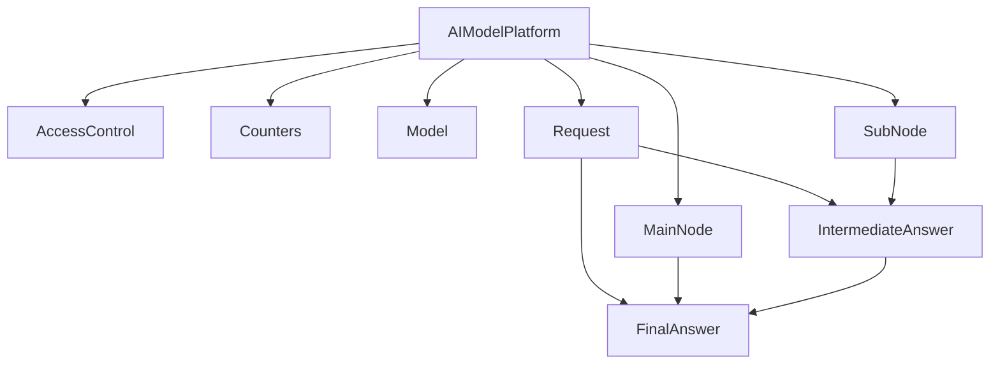
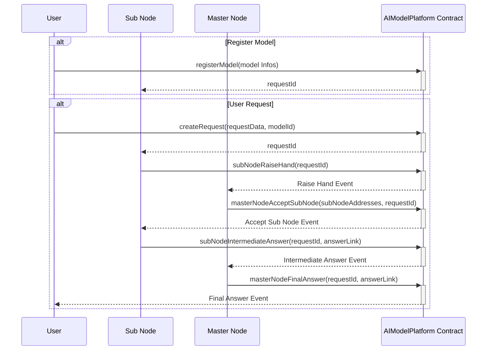

# AIModelPlatform.md

## Introduction
The `AIModelPlatform` contract is designed to facilitate a decentralized AI model execution and data labeling service. By leveraging robust role-based access management, it ensures that only authorized participants can perform specific actions within the system. This contract integrates essential functionalities to manage AI models, handle user requests, and coordinate between Master Nodes and Sub Nodes, maintaining system integrity and efficiency.

### Overview
The diagrams below provide a visual representation of how `AIModelPlatform.sol` interacts with its various features and dependencies. It primarily shows the flow of actions a user can initiate and how the contract interacts with other referenced contracts and utilities.

#### Top-down

#### Sequence

## Base Contracts
### OpenZeppelin
- [AccessControl](https://github.com/OpenZeppelin/openzeppelin-contracts/blob/master/contracts/access/AccessControl.sol): Provides role-based access control. It allows the creation of different roles and permissions for those roles, ensuring that only authorized addresses can call certain functions.
- [Counters](https://github.com/OpenZeppelin/openzeppelin-contracts/blob/master/contracts/utils/Counters.sol): Provides counters that can only be incremented, decremented, or reset. Useful for tracking the number of elements in a mapping, issuing ERC721 ids, or counting request ids.

## Features
- Inherits from OpenZeppelin's `AccessControl`, meaning it can define a flexible set of roles and permissions. Each role can have an associated admin role, and only accounts with the admin role can grant or revoke the associated role from other accounts.
- Uses OpenZeppelin's `Counters` library to manage auto-incrementing ids for models and requests.
- Defines the `Model`, `SubNode`, `Request`, `IntermediateAnswer`, and `FinalAnswer` structs to store necessary details.
- Provides mechanisms for Sub Nodes to express interest in handling a request and for Master Nodes to accept Sub Nodes and submit final answers.

## Events
These events offer a mechanism to track and audit the various interactions and updates that occur within the `AIModelPlatform` contract.

### `SubNodeRaiseHand`
This event is emitted when a Sub Node raises its hand to handle a request.
Logs:
- `subNodeAddress`: The address of the Sub Node raising its hand.
- `requestId`: The ID of the request.

### `MasterNodeAcceptSubNode`
This event is emitted when a Master Node accepts Sub Nodes for a request.
Logs:
- `subNodeAddresses`: The addresses of the accepted Sub Nodes.
- `requestId`: The ID of the request.

### `SubNodeIntermediateAnswer`
This event is emitted when a Sub Node submits an intermediate answer.
Logs:
- `subNodeAddress`: The address of the Sub Node submitting the intermediate answer.
- `requestId`: The ID of the request.

### `MasterNodeFinalAnswer`
This event is emitted when a Master Node submits the final answer.
Logs:
- `masterNodeAddress`: The address of the Master Node submitting the final answer.
- `requestId`: The ID of the request.

## Constructor
The constructor sets up the initial roles for the admin who deploys the contract and initializes model and request counters.

## Functions
### `registerModel()`
Allows `ADMIN` to register a new model. This function stores details about the model including its name, type, quantization type, execution code, model data, and calibration data.

### `createRequest()`
Allows users to create a new request. This function stores the request data and assigns a unique request ID.

### `subNodeRaiseHand()`
Allows Sub Nodes to express interest in handling a request. This function emits an event indicating the Sub Node's interest.

### `masterNodeAcceptSubNode()`
Allows Master Nodes to accept Sub Nodes for a particular request. This function emits an event with the accepted Sub Nodes' addresses.

### `subNodeIntermediateAnswer()`
Allows Sub Nodes to submit intermediate answers for a request. This function emits an event with the intermediate answer details.

### `masterNodeFinalAnswer()`
Allows Master Nodes to submit the final answer for a request. This function emits an event with the final answer details.

### `assignSubNode()`
Allows `ADMIN` to assign roles to Sub Nodes. This function sets up the performance tier and other details for the Sub Node.

### `assignMasterNode()`
Allows `ADMIN` to assign roles to Master Nodes. This function sets up the Master Node role for the specified address.

This contract ensures a robust and modular system for managing AI model requests and answers with a well-defined role-based access control mechanism.